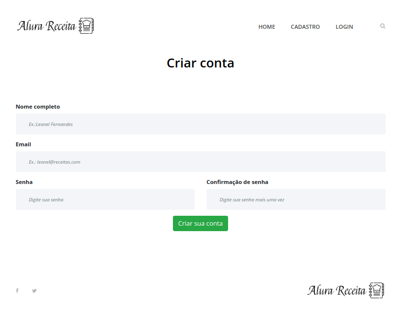
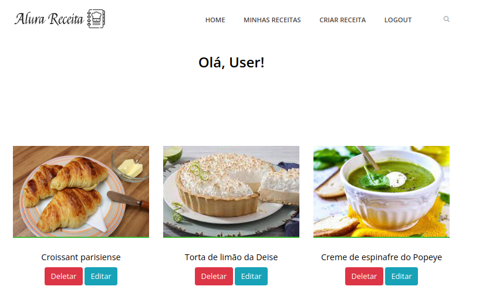
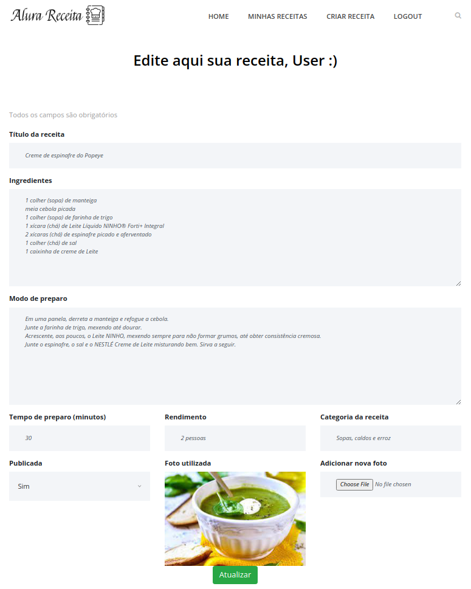

Crud de um app para caderno virtual de receitas. 

## Arquitetura

Aplicação web constituida de uma aplicação django fazendo frontend e backend end juntamente com um banco postgres e um 
servidor nginx. \
Para entender melhor a configuração dos serviços, veja: [docker-compose.yml](./docker-compose.yml).

## Dependências

Docker version 20.10.8 \
Docker-compose version 1.29.2 \
Django version 3.1.5 \
Gunicorn version 20.1.0 

Para uma lista completa das dependências do projeto, vá para [requirements.txt](./requirements.txt)

## Colocando tudo de pé

### 1. Instalando o docker e o docker-compose

Estamos fazendo o uso de docker para essa arquitetura mínima de uma aplicação funcional em desenvolvimento então, antes
que qualquer outra coisa, você precisa instalar o docker e o docker-compose. No
windows: [Docker - Instalação, configuraçãoe e primeiros passos](https://balta.io/blog/docker-instalacao-configuracao-e-primeiros-passos)
, para uma introdução ao docker
e [Como usar docker-compose](https://docs.microsoft.com/pt-br/visualstudio/docker/tutorials/use-docker-compose)
para o segundo serviço. Para a galerinha do
Ubuntu, [Como instalar e usar o docker no ubuntu 18.04](https://www.digitalocean.com/community/tutorials/como-instalar-e-usar-o-docker-no-ubuntu-18-04-pt)
e, para a segunda
aplicação, [Como instalar o docker compose no ubuntu 18.04](https://www.digitalocean.com/community/tutorials/how-to-install-docker-compose-on-ubuntu-18-04-pt)
. No caso do Ubuntu, eu testei esses links para instalar no 20.04 e tudo correu bem também.

### 2. Clonando o repositório

Se tudo tiver dado certo na instalação, você vai precisar clonar esse repositório no seu computador. Para isso,tendo o
[git](https://git-scm.com/book/pt-br/v2/Come%C3%A7ando-Instalando-o-Git) navegue pelo terminal até o diretório onde quer
baixar o projeto e `git clone https://github.com/LeoFernanndes/django-crud-receitas.git`.

### 3. Adicionado as variáveis de abiente

Tudo certo ate agora, vamos adicionar as variáveis de ambiente ao serviço da api. Crie um arquivo .env na dentro da
pasta api e adicione as seguintes variáveis e seus valores:

    DB_DEV_NAME=postgres
    DB_DEV_USER=postgres 
    DB_DEV_PASSWORD=postgres 
    DB_DEV_HOST=database 
    DB_DEV_PORT=5432

### 4. Vendo a mágica acontecer

`docker-compose up --build` e só. Como não estamos falando de magia, e sim de tecnologia, vamos abordar o que existe por
trás dessec comando que possibilita subir uma aplicação toda em uma só linha de código.

Obs.: Caso tenha algum processo como um apache, por exemplo, rodando na porta TCP 80, você receberá um erro avisando que
o nginx não pode subir em uma porta ocupada. Nesse caso, interrompa o processo ou altere a porta do nginx da nossa
aplicação dentro de [docker-compose.yml](./docker-compose.yml).

## Features
### Painel na página inicial 
Dashboard com as receitas declaradas públicas pelos usuários que as postaram. Para evitar redundância, não vou repetir a
imagem aqui ja que foi a escolhida para ilustrar o início desse README.

### Cadastro e login
Cadastro para login com basic auth do próprio django  

### Meu caderno de receitas
Zona privada onde o usuário pode criar e editar suas receitas sem a necessidade de necessariamente comparilhar essas 
rececitas com o público geral.

### Criação e edição de receitas

## Removendo os containeres

Caso você esteja com o terminal que está rodando a apliação aberto, use `CTRL+C` para interromper o processo, caso ja
tenha fechado a janela, vá novamente para o local onde rodou o `docker-compose up --build` mas agora
use `docker-compose donw`
para desmontar os serviços.
